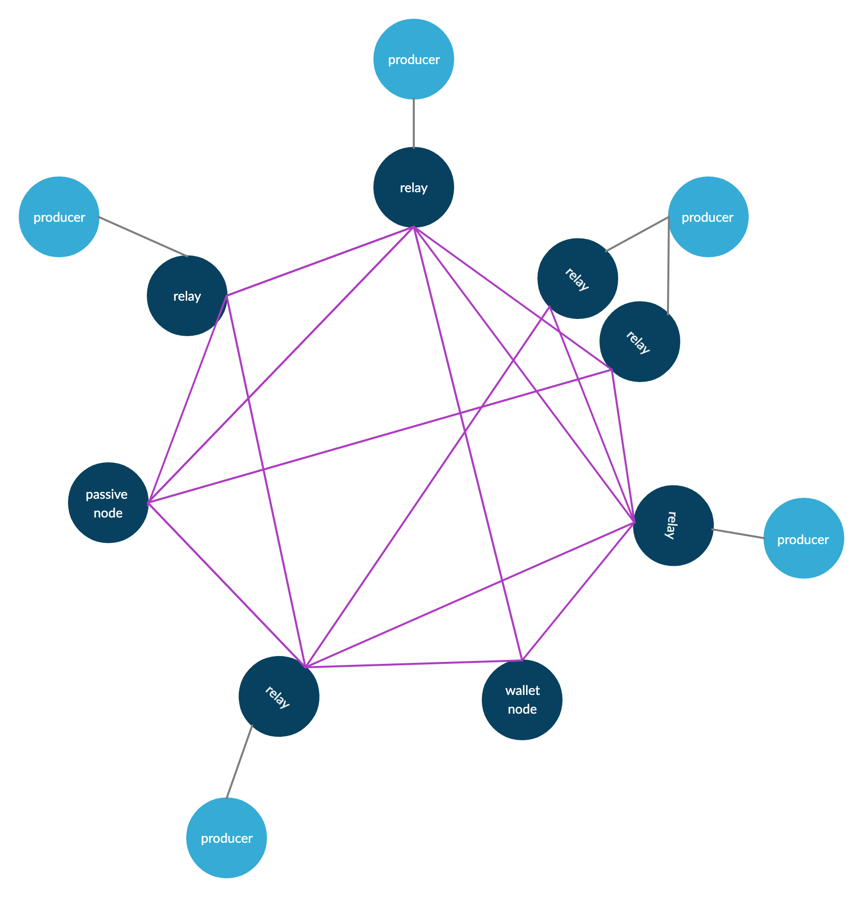

# Launching Cardano Relay Node

## Launching cardano-node as system service

Launching cardano node as a system service is the recommended way to run the process on production servers.



create a **systemd** service configuration file with all the keys and other settings, so the **cardano node process will be running in the background:**

```
cat <<EOF | sudo tee -a /etc/systemd/system/cardano-node.service
[Unit]
Description=Cardano Pool
After=multi-user.target
[Service]
Type=simple
ExecStart=/home/cardano/.local/bin/cardano-node run --config /home/cardano/cnode/config/mainnet-config.json --topology /home/cardano/cnode/config/mainnet-topology.json --database-path  /home/cardano/cnode/db/ --socket-path  /home/cardano/cnode/sockets/node.socket --host-addr 0.0.0.0 --port 3001    

KillSignal = SIGINT
RestartKillSignal = SIGINT
StandardOutput=syslog
StandardError=syslog
SyslogIdentifier=cardano
LimitNOFILE=32768


Restart=on-failure
RestartSec=15s
WorkingDirectory=~
User=cardano
Group=cardano
[Install]
WantedBy=multi-user.target
EOF
```

let's enable the service and start it:

```
sudo systemctl enable cardano-node.service
sudo systemctl start cardano-node.service
```


Now let's check if our cardano node process is running!

```
journalctl -u cardano-node.service -f -o cat
```






**We have set up your first relay node!** &#x20;

**As a next step - you can do the same for your core/relay server as you need a minimum of 2 servers**

**1) Relay node, a s**erver that is between your core server and other relay servers,  serves as a protection to your core\
**2) core node (producer)**: a server which is producing blocks\
**3) cold PC/hardware wallet:** a secure computer on which you are generating Stake Pool Keys and wallets.

Ideally, for each core server, you would have 2 relay servers where they can connect



****


**NEVER, EVER generate your wallet and stake pool keys on your online servers! It's a BAD, BAD practice. Install on your local machine VirtualBox+Ubuntu and do the wallet and key registration (either by hand or using CNTOOLS or Martins SPOS scripts)**


**if you need any help - you can contact us directly using Telegram:** [**https://t.me/StakePool247help**](https://t.me/StakePool247help) **** \
****
